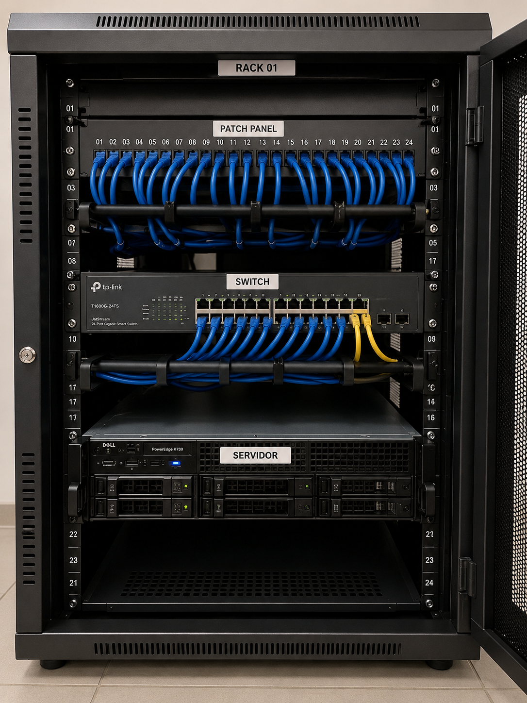

# Projeto Prático - Parte 4

## 1. Organização do Rack
O rack seria organizado da seguinte forma:
- Patch Panel na parte superior
- Switch logo abaixo do Patch Panel
- Servidor na parte inferior do rack

## 2. Localização dos equipamentos
- Patch Panel: topo do rack para facilitar a distribuição dos cabos.
- Switch: abaixo do Patch Panel para conexão curta e organizada.
- Servidor: parte inferior para maior estabilidade devido ao peso.

## 3. Identificação dos cabos
Os cabos seriam identificados com etiquetas contendo:
- Número da porta
- Nome do equipamento
- Setor ou destino da conexão

Exemplo:
PORTA 01 - SERVIDOR
PORTA 02 - RECEPÇÃO

## 4. Foto de referência
Foi utilizada uma imagem de um rack organizado como modelo de boas práticas.

## 5. Importância das tampas laterais e portas do rack
Não devemos deixar o rack aberto porque isso aumenta o risco de poeira, superaquecimento, desconexões acidentais e acesso indevido aos equipamentos.

